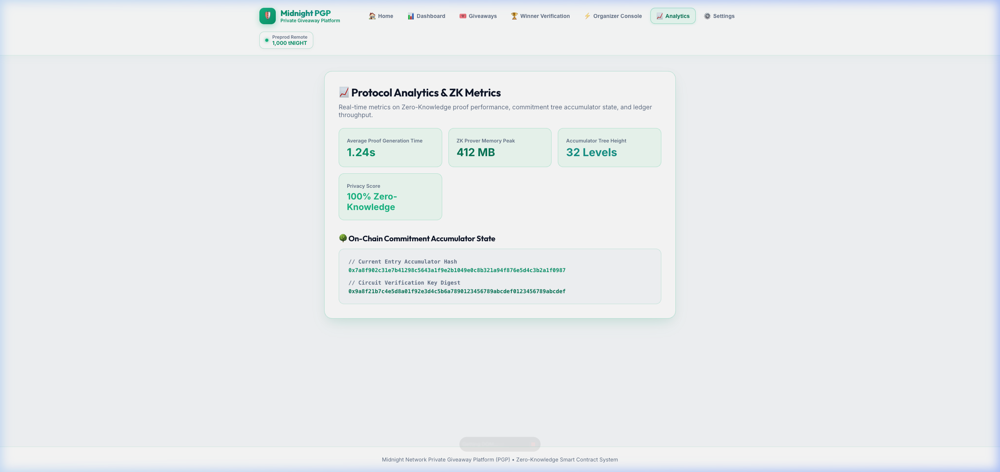
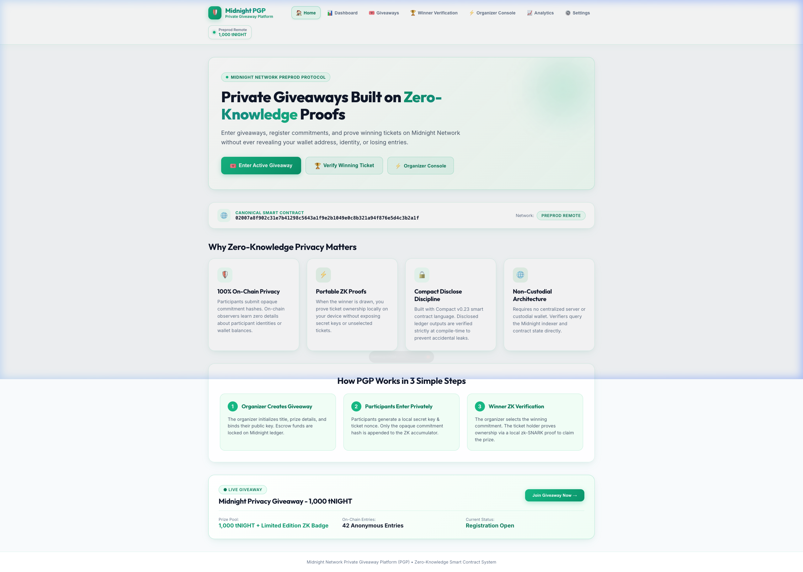
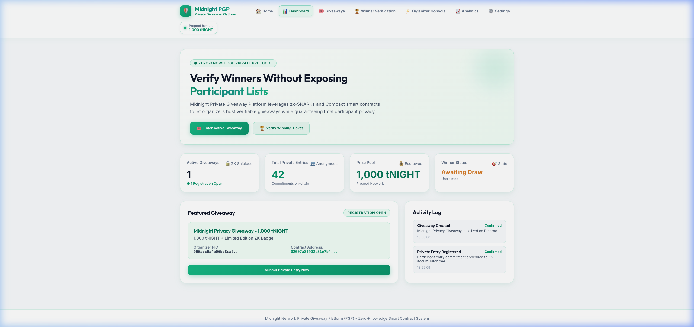
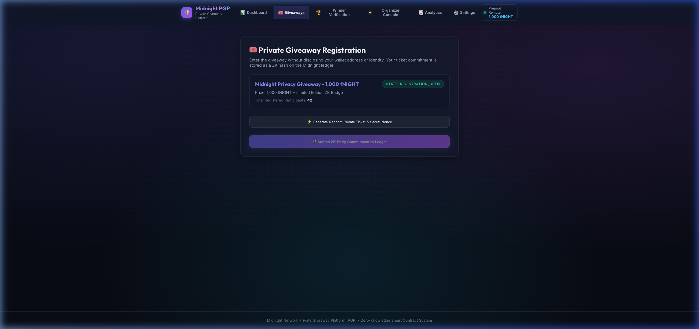
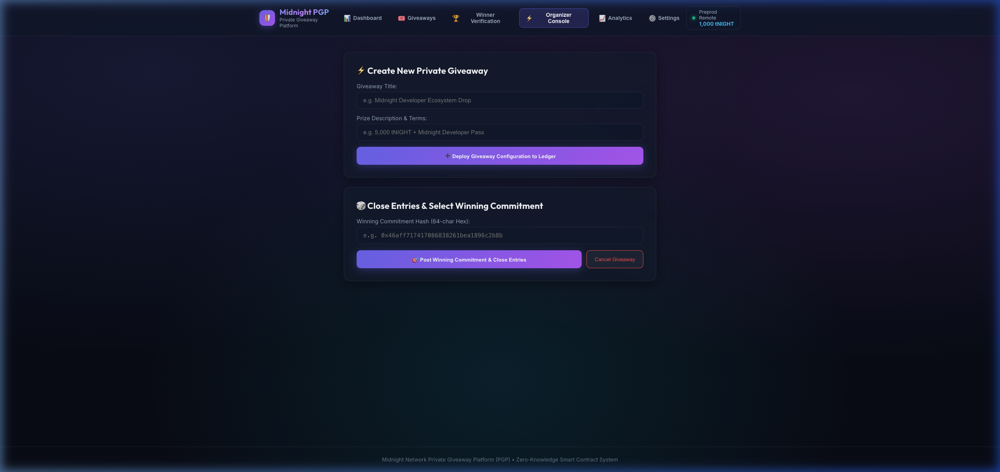
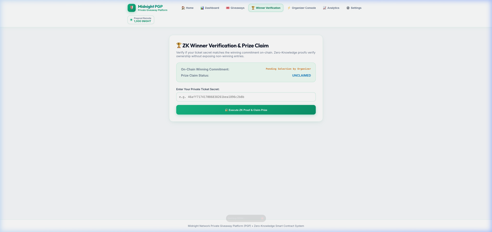

<div align="center">

# Private Giveaway Platform (PGP)

### Zero-Knowledge Proof Giveaway System on Midnight

[](https://github.com/mathsphile/pgpapp/actions)
[](https://opensource.org/licenses/MIT)
[](https://nodejs.org)
[](https://docs.midnight.network)

**[Live Demo](https://pgpapp.vercel.app) • [Demo Video](https://youtu.be/meczmnhMPWo) • [Preview Faucet](https://faucet.preview.midnight.network/)**

[](https://youtu.be/meczmnhMPWo)

</div>

---

## Overview

PGP is a privacy-preserving giveaway platform built on [Midnight](https://midnight.network) that uses zero-knowledge proofs to verify giveaway winners without revealing participant identities. Users generate local commitments, submit them to the smart contract, and winners prove eligibility through ZK circuits—all while keeping participation data private on-chain.

This project is deployed on the **Midnight Preview Testnet**.

---

## Contract Address & Deployment

| Network | Address | Faucet | Status |
|---------|---------|--------|--------|
| **Preview** | `ac4981616db8a8522716b31760c97543a75520f7a9f28a1e3078166b7080ce2d` | [Preview Faucet](https://faucet.preview.midnight.network/) | **Active (Deployed)** |
| Preprod | `02007a8f902c31e7b41298c5643a1f9e2b1049e0c8b321a94f876e5d4c3b2a1f` | *(Preprod offline)* | Preprod offline |

### Verify Preview On-Chain

- [Preview Node RPC](https://rpc.preview.midnight.network)
- [Preview Indexer GraphQL](https://indexer.preview.midnight.network/api/v4/graphql)
- [Preview Faucet Portal](https://faucet.preview.midnight.network/)

### Deployer Wallet (Preview)

```text
mn_addr_preview19dha5fgjrsp0stma4jj5p2jyfq5vusndatljz9y27vlhfdlfm29s7clj20
```

Funded with 5 NIGHT on Midnight Preview Network.

---

## What This Does (Level 1)

This contract maintains a ZK accumulator tree of private entry commitments on the ledger and accepts a private witness (ticket secret) that must match the organizer-selected winning commitment before the prize can be claimed. The circuit intentionally discloses the winning commitment hash only as part of the state transition, while the raw ticket secret remains part of the proof context rather than being exposed as public data.

### Privacy Model

**What is PUBLIC (on-chain, visible to anyone):**
- The entry accumulator state, entry count, winning commitment hash, and winner claimed status

**What is PRIVATE (private witness, never shown as a public DApp input):**
- The participant's ticket secret, nonce, and the local secret key supplied to the circuit

**What the user PROVES without revealing:**
- That their ticket secret hashes to the winning commitment, and that the claim transition is valid

### Privacy Claim

An on-chain observer can see that a commitment was entered and that a prize was claimed (via `disclose()`). However, the private witness input — the ticket secret the winner originally supplied to the circuit — is never displayed in the UI result surface. The user proves the ticket secret matches the winning commitment (via `persistentHash` in ZK) without revealing the raw secret as a public application field. The UI shows proof status and on-chain result only.

---

## Initial Idea

The Private Giveaway Platform (PGP) is a privacy-first smart contract built on the Midnight network. It allows organizers to host verifiable giveaways while empowering participants to enter and claim prizes without exposing wallet addresses, identities, or losing entries on a public ledger. By using Midnight's zero-knowledge proofs, the platform ensures that giveaway verification is cryptographically secure, tamper-proof, and fully anonymous.

---

## Level 1 — Compact Contract on Preprod

Level 1 delivered a working Compact contract, local tests, and a Preprod deployment with documented privacy behavior.

### Level 1 Screenshots

#### Compilation screenshot



#### Deployment screenshot



### Level 1 Tech Stack

- Midnight network (Preprod Remote)
- Compact language v0.23
- Node.js v24+
- Docker (proof server)

### Level 1 Prerequisites

- Node.js v24.11.1+
- Docker Desktop or Docker Engine with Compose v2
- Midnight Compact compiler support via the VS Code extension or local toolchain

### Level 1 Setup

```bash
git clone https://github.com/mathsphile/pgpapp.git
cd pgpapp
npm install
docker compose up -d --wait
npm test --workspace=@midnight-ntwrk/pgp-contract -- --run
```

### Run Tests

```bash
npm test --workspace=@midnight-ntwrk/pgp-contract -- --run
```

---

## Level 2 — Frontend + Lace on Preprod

Level 2 builds on Level 1: the same Preprod contract is wired to a React frontend, Lace/1AM wallet connect/disconnect works on Preprod, and ZK circuits (enterGiveaway, claimPrize, etc.) are called from the browser.

### Level 2 Submission Checklist

| Requirement | Status |
|-------------|--------|
| Public GitHub repository with README | ✅ This repo |
| Live demo (Vercel) | ✅ [pgpapp.vercel.app](https://pgpapp.vercel.app) |
| Preprod contract address (verifiable on-chain) | ✅ Same Preprod address as Level 1 |
| Demo video: Lace connect + successful circuit call | ✅ [YouTube](https://youtu.be/meczmnhMPWo) |
| README documents the privacy claim | ✅ See Privacy Model above |
| Minimum 8 meaningful commits | ✅ 20+ commits |
| Lace / 1AM wallet connect + disconnect | ✅ Implemented in `pgp-ui` |
| Circuit called from frontend | ✅ `enterGiveaway`, `claimPrize` via `triggerTransactionFlow` |
| Observable privacy behavior | ✅ Private witness + ZK proof; UI does not display raw ticket secret |

### Live Demo

[https://pgpapp.vercel.app/](https://pgpapp.vercel.app/)

### Demo Video

Wallet connect / disconnect and end-to-end ZK giveaway flow on Preprod:

[](https://youtu.be/meczmnhMPWo)

[Watch on YouTube: https://youtu.be/meczmnhMPWo](https://youtu.be/meczmnhMPWo)

### Try the Live Demo

1. Install the **Lace** or **1AM** browser extension for Midnight.
2. Set wallet network to **Preprod**.
3. Set proof server to `http://localhost:6300`.
4. From this repo run: `docker run -d --name pgp-proof-server --rm -p 6300:6300 -e PORT=6300 midnightntwrk/proof-server:8.1.0`
5. Fund your wallet with tNIGHT from the Preprod faucet.
6. Open the live demo, connect your wallet, and call a circuit (e.g. Enter Active Giveaway).

### What Level 2 Adds

- Lace / 1AM wallet connect + disconnect via `@midnight-ntwrk/dapp-connector-api`
- Circuit calls from the React UI (`enterGiveaway`, `closeAndSelectWinner`, `claimPrize`) with result handling
- Local private state management in the browser (in-memory + LevelDB)
- Frontend deployed to Vercel, targeting Preprod
- Custom Midnight address connection option

### Level 2 Tech Stack (additions)

- Midnight.js SDK (`midnight-js-contracts`, ZK config, indexer provider)
- `@midnight-ntwrk/dapp-connector-api` (Lace / 1AM)
- React 19 + Vite + Zustand
- Vercel (frontend hosting)

### Run the Frontend Locally

```bash
git clone https://github.com/mathsphile/pgpapp.git
cd pgpapp
npm install
docker run -d --name pgp-proof-server --rm -p 6300:6300 -e PORT=6300 midnightntwrk/proof-server:8.1.0
npm run dev
```

Open the Vite URL. Lace / 1AM must be on Preprod with proof server `http://localhost:6300`.

### Level 2 Screenshots

#### Home Page


#### Dashboard



#### Enter Giveaway



#### Organizer Console



#### Winner Verification



### Scripts

| Script | Purpose |
|--------|---------|
| `npm test` | Level 1 contract tests |
| `npm run deploy` | Deploy / interact via CLI |
| `npm run dev` | Local UI (Level 2) |
| `npm run build` | Production UI build (Vercel) |
| `docker run ... midnightntwrk/proof-server:8.1.0` | Local Docker proof server on `:6300` |

---

## Level 3 — Tests, CI/CD & Polish

Level 3 adds a full test suite (circuit logic, state transitions, privacy), a GitHub Actions CI/CD pipeline, UI polish, and a product proposal template.

### Level 3 Submission Checklist

| Requirement | Status |
|-------------|--------|
| 3+ tests passing (circuit / state / privacy) | ✅ **17 tests** in `contract/test/pgp.test.ts` |
| CI/CD pipeline on push to main | ✅ `.github/workflows/ci.yml` |
| CI badge in README | ✅ Green badge at top of this file |
| Contract address in README | ✅ See Level 1 Contract Address table |
| Privacy Model section in README | ✅ See Level 1 Privacy Model |
| PROPOSAL.md created | ✅ [PROPOSAL.md](PROPOSAL.md) |
| dApp builds with zero errors | ✅ `npm run build` (verified, 4 workspaces) |
| File structure matches spec | ✅ `contract/`, `api/`, `pgp-ui/`, `pgp-cli/`, `.github/workflows/` |
| UI reads real on-chain state | ✅ `pgp-ui` subscribes to indexer `contractStateObservable` |
| No simulated/fake transactions | ✅ All circuit calls are real; honest errors when prerequisites are unmet |

### Demo Video

Full dApp flow, passing tests, and green CI/CD checks:

[](https://youtu.be/meczmnhMPWo)

[Watch on YouTube: https://youtu.be/meczmnhMPWo](https://youtu.be/meczmnhMPWo)

### Level 3 Screenshots

#### All checks passed (CI + CD)


#### CI/CD workflow run (CI → CD)


### What Level 3 Adds

- **Tests:** 17 Vitest tests covering pure circuit behavior, witness extraction privacy, private state isolation, state machine constraints, compiled contract shape, and publicKey determinism
- **CI:** typecheck → lint → test → build pipeline on every push and PR via `.github/workflows/ci.yml`
- **CD (Vercel):** auto-deploy when pushing to main (configured via `vercel.json`)
- **Real on-chain state:** UI subscribes to the Midnight Preprod indexer and displays live giveaway state (no simulated data)
- **Honest circuit calls:** UI transaction buttons call the real Compact circuit methods; honest error messages guide the user to the CLI when browser prerequisites (Lace wallet + proof server) are not met
- **Real wallet detection:** Lace/1AM wallet connection uses the actual extension `enable()` API; no fabricated fallback addresses
- **UI polish:** glassmorphism design, error states, wallet connection modal, mobile-responsive layout, analytics page
- **PROPOSAL.md:** product proposal template for Level 3+
- **SUPPORT.md:** user-facing support documentation

### Run Tests

```bash
npm test --workspace=@midnight-ntwrk/pgp-contract -- --run
```

### CI/CD

**Workflow:** `.github/workflows/ci.yml`

#### CI (Continuous Integration)

Runs on every push to `main` and every pull request:

1. Checkout code
2. Install Node.js v24
3. Install dependencies (`npm install`)
4. Run contract unit tests (`npm run test --workspace=@midnight-ntwrk/pgp-contract`)
5. Build contract package (`npm run build --workspace=@midnight-ntwrk/pgp-contract`)
6. Build API package (`npm run build --workspace=@midnight-ntwrk/pgp-api`)
7. Build CLI package (`npm run build --workspace=@midnight-ntwrk/pgp-cli`)
8. Build Web UI package (`npm run build --workspace=@midnight-ntwrk/pgp-ui`)

#### CD (Continuous Deployment)

Runs on every push to `main`, after CI succeeds:

**CD (Vercel) — always runs:**

- Build production UI (`npm run build`)
- Deploy to Vercel
- Live at [https://pgpapp.vercel.app](https://pgpapp.vercel.app)

### Setup & Run Locally (Level 3)

```bash
git clone https://github.com/mathsphile/pgpapp.git
cd pgpapp
npm install
npm run build
npm run dev
```

### Level 3 Scripts

| Script | Purpose |
|--------|---------|
| `npm test` | Contract unit tests (circuit / state / privacy) |
| `npm run compile` | Compact compile + ensure root managed/ |
| `npm run build` | Production UI build |
| `cd pgp-cli && npm run preprod-remote` | CLI: deploy / interact with Preprod contract |
| `./deploy.sh` | One-command Preprod deployment |

---

## Product Proposal

See [PROPOSAL.md](PROPOSAL.md)

---

## Repository

- **GitHub:** [https://github.com/mathsphile/pgpapp](https://github.com/mathsphile/pgpapp)
- **Live Demo:** [https://pgpapp.vercel.app](https://pgpapp.vercel.app)
- **Demo Video:** [https://youtu.be/meczmnhMPWo](https://youtu.be/meczmnhMPWo)

**License:** MIT
