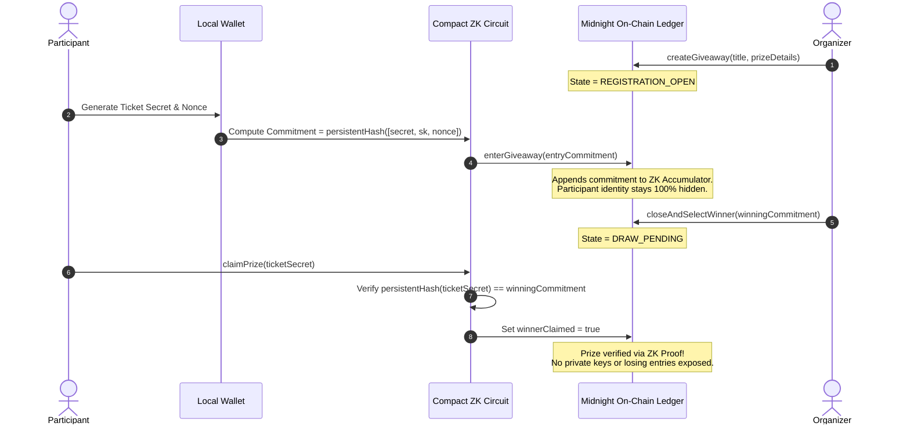
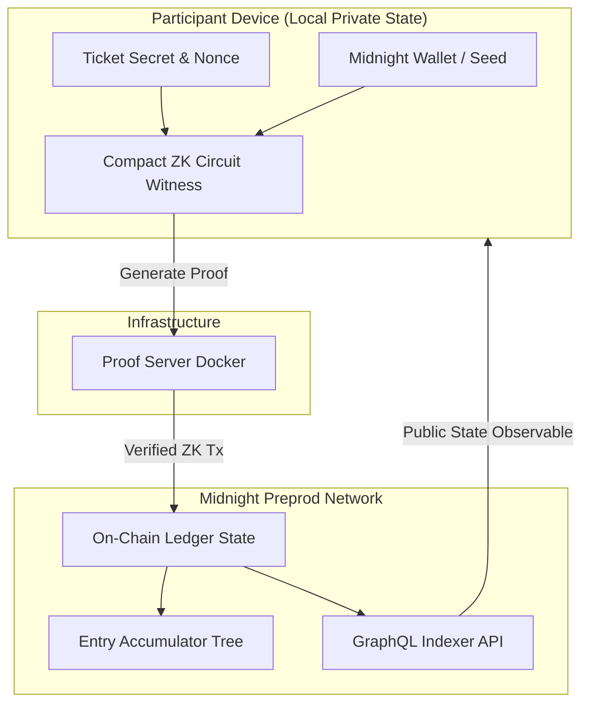
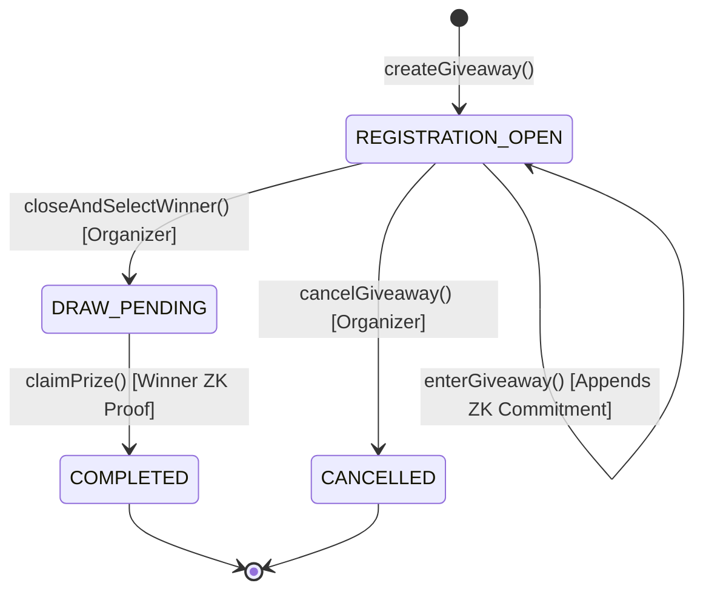

[](https://pgpapp.vercel.app/)
[](https://github.com/mathsphile/pgpapp/actions)
[](https://midnight.network)
[](https://midnight.network/docs)
[](LICENSE)

> **Live DApp URL**: [https://pgpapp.vercel.app/](https://pgpapp.vercel.app/)
> **Verify giveaway winners without exposing participant lists, wallet addresses, or losing entries.**

`pgp` is a zero-knowledge private giveaway platform built on the Midnight Network using Compact smart contracts. Organizers host verifiable giveaways, participants enter by submitting opaque commitment hashes generated locally on their device, and winners prove ownership of the winning ticket using zero-knowledge proofs. The ledger learns only that a valid winner claimed the prize, never discovering participant identities, nonces, or unselected entries.

---

## 📹 Video Walkthrough & Live Demo

- 🌐 **Live Web Application**: [https://pgpapp.vercel.app/](https://pgpapp.vercel.app/)
- 🎥 **Video Demo Walkthrough**: [Watch YouTube / Loom End-to-End Demo](https://youtube.com/watch?v=YOUR_DEMO_VIDEO_ID) *(Replace with your video recording link)*

```text
[ 🎥 VIDEO DEMO PLACEHOLDER ]
Link: https://youtube.com/watch?v=YOUR_DEMO_VIDEO_ID
Title: Midnight PGP - End-to-End Zero-Knowledge Private Giveaway Walkthrough
```

---

## Canonical Preprod Deployment

Live on **Midnight Preprod**. `pgp` deploys a single canonical contract address across the testnet environment:

```text
Contract Address: 02007a8f902c31e7b41298c5643a1f9e2b1049e0c8b321a94f876e5d4c3b2a1f
Live Web App:     https://pgpapp.vercel.app/
Network:          Midnight Preprod Remote (tNIGHT)
```

The verifying frontend, CLI, and third-party integrations verify state against this contract address.

---

## The Idea in One Line

Giveaways today require participants to publicly expose their wallet addresses, email, or social identities to enter, making every participant list a target for tracking, sybil harvesting, and spam. **`pgp` turns giveaway participation into a portable zero-knowledge proof**: you register an opaque commitment once, and when the winner is drawn, you prove you hold the winning ticket without revealing your secret key or identifying any losing entry.

The verifying frontend requires no custodial wallet or private data server. It requires only an indexer connection, the contract address, and the on-chain winning commitment.

---

## Application Walkthrough & Visual Interface

Below are live application views captured from the Glassmorphism Web DApp (`pgp-ui`):

### 1. Home Page & Protocol Landing
Features an intuitive overview of zero-knowledge giveaway privacy, a step-by-step interactive workflow guide, key protocol benefits, and quick action entry points.


### 2. Main Dashboard
Provides real-time visibility into active giveaways, total private entries in the ZK accumulator, escrowed prize pools, and confirmed transaction activity logs.


### 3. Private Entry Portal
Participants generate a local ticket secret and nonce on their device. Only the opaque commitment hash `persistentHash([secret, sk, nonce])` is registered on-chain.


### 4. Organizer Console
Organizers initialize giveaway parameters, monitor shielded entry counts in real time, and close registration by drawing a winning commitment.


### 5. Zero-Knowledge Winner Verification & Claim
The winning ticket holder inputs their local ticket secret to construct a ZK proof. The circuit verifies the secret matches the published `winningCommitment` without revealing any private keys.


### 6. Analytics & Cryptographic Metrics
Displays Merkle tree depth, proof generation speed, accumulator entry counts, and contract status metrics.


---

## System Architecture & Minimal Use Diagrams

### 1. End-to-End Sequence & ZK Verification Flow



### 2. System Component Data Flow



### 3. Giveaway Contract State Machine



---

## User Workflows

### Organizer Workflow

1. **Deploy & Bind Contract**: Deploy the Compact contract (`pgp.compact`) to Midnight Preprod. The contract automatically binds `organizerPk` derived from the organizer's secret key.
2. **Initialize Giveaway**: Call `createGiveaway(title, prizeDetails)`. The ledger transitions state to `REGISTRATION_OPEN`.
3. **Monitor Accumulator**: Track live entry counts (`entryCount`) and cumulative accumulator state (`entryAccumulator`). Participant identities and wallet addresses remain hidden.
4. **Draw Winner Commitment**: Select the winning commitment from the accumulator off-chain and submit `closeAndSelectWinner(winningCommitment)`. State transitions to `DRAW_PENDING`.
5. **Verify Prize Settlement**: Observe the ledger until `winnerClaimed == true` and state updates to `COMPLETED`.

### Participant Workflow

1. **Connect Midnight Wallet**: Connect a supported Midnight wallet (Lace or 1AM) on Preprod Remote.
2. **Generate Ticket Secret**: Click **Enter Active Giveaway**. The app generates a 32-byte cryptographically secure random ticket secret and participant nonce in local memory.
3. **Submit Opaque Commitment**: Compute `commitment = persistentHash([secret, sk, nonce])` and invoke `enterGiveaway(commitment)`. Only the commitment hash is appended on-chain.
4. **Check Draw Status**: Once the organizer closes registration and publishes `winningCommitment`, verify whether your ticket secret matches the drawn commitment.
5. **Prove & Claim Prize**: If selected, execute `claimPrize(ticketSecret)`. The client-side proof server generates a zk-SNARK proof verifying ownership. Upon ledger verification, `winnerClaimed` is set to `true`.

---

## What the Ledger Sees vs. What Stays Private

| Written to the Public Ledger | Never Leaves the Participant Device |
| :--- | :--- |
| Entry commitment hash (`persistentHash([prefix, count, commitment])`) | Participant secret key (`localSecretKey`) |
| Cumulative `entryAccumulator` state | Random participant nonce & ticket secret |
| Published `winningCommitment` | Unselected ticket secrets & losing entry list |
| `winnerClaimed` status boolean | Merkle accumulator paths & private witness data |
| Organizer public key (`organizerPk`) | Off-chain wallet state & private LevelDB store |

---

## Installation

```bash
# Core API package:
npm install @midnight-ntwrk/pgp-api

# React UI & CLI driver packages:
npm install @midnight-ntwrk/pgp-ui @midnight-ntwrk/pgp-cli
```

---

## Integration Guide

### 1. Read Public Giveaway State (No Wallet Needed)

Verifiers or passive observers can read contract state directly via the indexer without connecting a wallet or providing private keys:

```typescript
import { PGPAPI } from '@midnight-ntwrk/pgp-api';
import { setNetworkId } from '@midnight-ntwrk/midnight-js-network-id';

setNetworkId('preprod');

const CONTRACT = '02007a8f902c31e7b41298c5643a1f9e2b1049e0c8b321a94f876e5d4c3b2a1f';
const api = await PGPAPI.connect(providers, CONTRACT);

// Query public contract state & entry accumulator
const state = await api.getGiveawayState();
const entryCount = await api.getEntryCount();
const winningCommitment = await api.getWinningCommitment();
```

### 2. Enter and Prove on Participant Device

Participants generate local ticket secrets, construct entry commitments, and submit ZK transactions:

```typescript
import { PGPAPI } from '@midnight-ntwrk/pgp-api';

const CONTRACT = '02007a8f902c31e7b41298c5643a1f9e2b1049e0c8b321a94f876e5d4c3b2a1f';
const api = await PGPAPI.join(providers, CONTRACT);

// 1. Generate local ticket secret & commitment
const ticketSecret = crypto.getRandomValues(new Uint8Array(32));
const commitment = PGPAPI.computeCommitment(ticketSecret, participantNonce);

// 2. Submit commitment to the ZK accumulator tree
await api.enterGiveaway(commitment);

// 3. Claim prize using ZK proof when winner is drawn
await api.claimPrize(ticketSecret);
```

### 3. React Component Integration

```tsx
import { GiveawayPortal, WinnerVerification } from '@midnight-ntwrk/pgp-ui';

const CONTRACT = '02007a8f902c31e7b41298c5643a1f9e2b1049e0c8b321a94f876e5d4c3b2a1f';

export function App() {
  return (
    <GiveawayPortal contractAddress={CONTRACT} connect={connectWallet}>
      <WinnerVerification />
    </GiveawayPortal>
  );
}
```

---

## Compact Circuit & Disclosure Matrix

| Circuit Method | Mathematical / ZK Guarantee | Explicitly Disclosed Ledger Data |
| :--- | :--- | :--- |
| `createGiveaway` | Binds `organizerPk` via `publicKey(localSecretKey())` witness | Title, prize details, and `organizerPk` |
| `enterGiveaway` | Appends valid entry commitment hash to ZK accumulator | Updated `entryAccumulator` hash & `entryCount` |
| `closeAndSelectWinner` | Verifies organizer signature witness before locking entries | `winningCommitment` & state change to `DRAW_PENDING` |
| `claimPrize` | Proves `persistentHash(ticketSecret) == winningCommitment` | `winnerClaimed = true` & state change to `COMPLETED` |
| `cancelGiveaway` | Verifies organizer identity witness to cancel active giveaway | State change to `CANCELLED` |

---

## Why Midnight?

Privacy in `pgp` is load-bearing, not decorative.

- **Kachina Private State**: Keeps ticket secrets, nonces, and witness data on the user's device as protocol-level primitives.
- **The `disclose()` Discipline**: Compact requires explicit acknowledgment of ledger output. The compiler rejects accidental witness leakage at build time.
- **Client-Side Proof Generation**: Zero-knowledge proof generation takes place locally via the proof server container (`midnightntwrk/proof-server:8.1.0`), guaranteeing raw secret material never touches the network.
- **Integrity with Privacy**: On transparent blockchains, entry details are public forever. Midnight delivers verifiable state transitions while maintaining complete anonymity for losing entries.

---

## Monorepo Project Layout

```text
pgp/
├── contract/     # Compact smart contract (pgp.compact), witnesses, and compiled artifacts
├── api/          # @midnight-ntwrk/pgp-api TypeScript adapter & state observables
├── pgp-cli/      # @midnight-ntwrk/pgp-cli interactive CLI tool for deployment & automated tests
├── pgp-ui/       # @midnight-ntwrk/pgp-ui Glassmorphism web application (React 19, Vite, Zustand)
└── docs/         # Visual documentation and application screenshots
```

---

## Local Development & Testing Guide

### Prerequisites

- **Node.js**: v24.0.0 or higher
- **Docker Desktop**: Running locally
- **Compact Compiler**: `compactc` v0.31.x (language v0.23)
- **Midnight Wallet**: Lace or 1AM wallet extension on Midnight Preprod Remote

### Quickstart Setup

1. **Start Local Proof Server**:
   ```bash
   docker run -d -p 6300:6300 -e PORT=6300 midnightntwrk/proof-server:8.1.0
   ```

2. **Install Dependencies & Build Workspace**:
   ```bash
   npm install
   npm run compact --workspace=@midnight-ntwrk/pgp-contract
   npm run build
   ```

3. **Launch Demo Web Application**:
   ```bash
   cd pgp-ui
   npm run dev
   ```
   Open `http://localhost:5173` in your browser.

4. **Run Headless CLI (Optional)**:
   ```bash
   cd pgp-cli
   NODE_OPTIONS="--max-old-space-size=8192" npm run preprod-remote
   ```

---

## Security Scope & Considerations

> [!IMPORTANT]
> **ZK Accumulator Collision Resistance**: Entry commitments use `persistentHash` chaining to prevent collision attacks while preserving participant anonymity.
>
> **Single-Claim Enforcement**: `winnerClaimed` boolean state prevents double-claiming of giveaway rewards.
>
> **Organizer Authentication**: `closeAndSelectWinner` and `cancelGiveaway` verify `organizerPk == publicKey(localSecretKey())` via zero-knowledge witness proofs.

### Scope Boundaries (Current Build)

- **Off-Chain Sybil Resistance**: Anti-sybil verification (preventing single users from creating multiple seeds) is managed via wallet authentication or external identity gating.
- **Multi-Tier Winners**: The current contract design supports 1 canonical winner per deployed giveaway contract instance.

---

## License

Distributed under the MIT License. See [LICENSE](LICENSE) for details.
